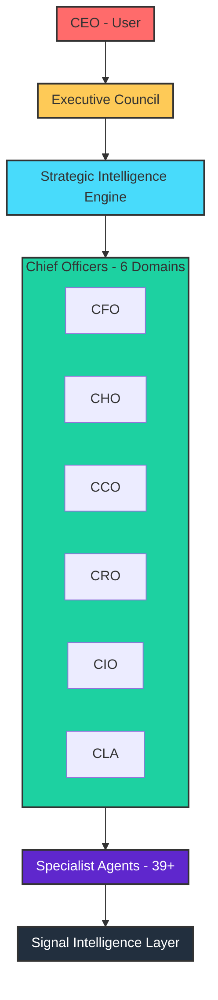

# System Architecture Overview

## Busy Bee Full Stack Architecture

## Quick Reference

| Layer | Components | Description |
|-------|------------|-------------|
| CEO | User | Final decision authority |
| Executive Council | 6 Chief Officers | Cross-domain coordination |
| Strategic Engine | 5 Sub-engines | Strategy brain |
| Chief Officers | CFO, CHO, CCO, CRO, CIO, CLA | Domain leadership |
| Specialist Agents | 39+ agents | Domain analysis |
| Signal Layer | Global Signal Bus | Data foundation |

---

*Diagram: BB-DIAG-001-01*
