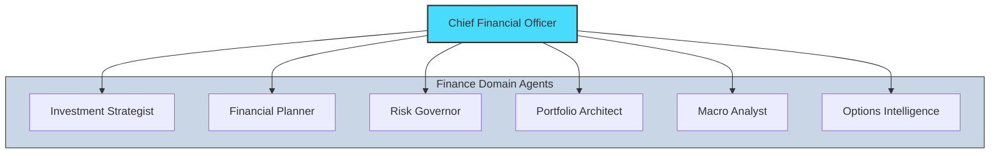
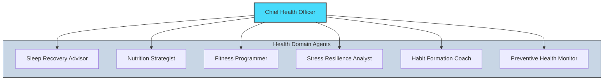
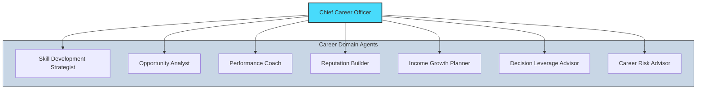
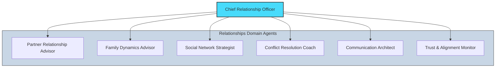
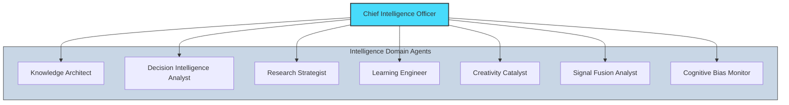
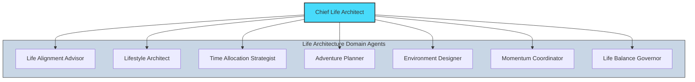

# Domain Agent Map

## All 6 Domains with Specialist Agents

### Finance Domain

### Health Domain

### Career Domain

### Relationships Domain

### Intelligence Domain

### Life Architecture Domain

---

## Agent Role Summary

| Role Type | Description | Count Across System |
|-----------|-------------|-------------------|
| **Strategist** | Generate plans, recommendations | ~30 |
| **Observer** | Detect patterns, signals | ~6 |
| **Governor** | Enforce safety, limits, alignment | 6 |

---

*Diagram: BB-DIAG-001-03*
