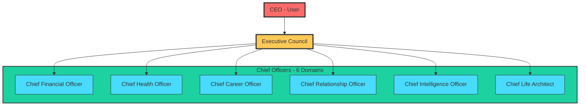

# Executive Hierarchy Diagram

## Organizational Structure

## Council Composition

| Officer | Domain | Primary Responsibility |
|---------|--------|----------------------|
| CFO | Finance | Capital allocation strategy |
| CHO | Health | Wellness strategy |
| CCO | Career | Career growth strategy |
| CRO | Relationships | Relational strategy |
| CIO | Intelligence | Knowledge strategy |
| CLA | Life Architecture | Life design strategy |

## Authority Flow

1. **CEO** - Final decision authority
2. **Executive Council** - Strategic coordination
3. **Chief Officers** - Domain leadership
4. **Specialist Agents** - Analysis and recommendations

---

*Diagram: BB-DIAG-001-02*
