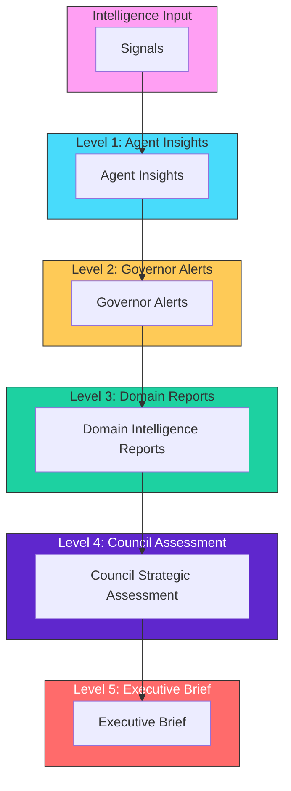
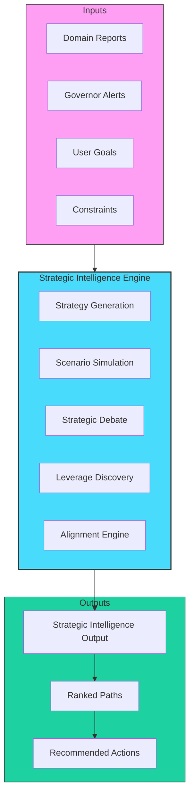

# Intelligence Pipeline Diagram

## Reporting Flow (BB-DOM-003)

## Pipeline Stages

| Level | Artifact | Producer | Description |
|-------|----------|----------|-------------|
| 1 | Agent Insights | Specialist Agents | Domain-specific analysis |
| 2 | Governor Alerts | Governor Agents | Risk/violation warnings |
| 3 | Domain Reports | Chief Officers | Domain synthesis |
| 4 | Council Assessment | Executive Council | Cross-domain coordination |
| 5 | Executive Brief | System | CEO-ready summary |

## Strategic Intelligence Flow

### Time Horizons

| Horizon | Duration | Focus |
|---------|-----------|-------|
| **Immediate** | 1-14 days | Urgent actions |
| **Near-Term** | 1-12 weeks | Tactical planning |
| **Mid-Term** | 3-12 months | Strategic initiatives |
| **Long-Term** | 1-5 years | Life architecture |

---

*Diagram: BB-DIAG-001-05*
