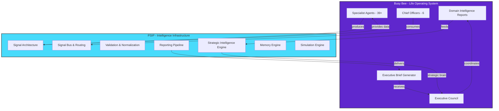
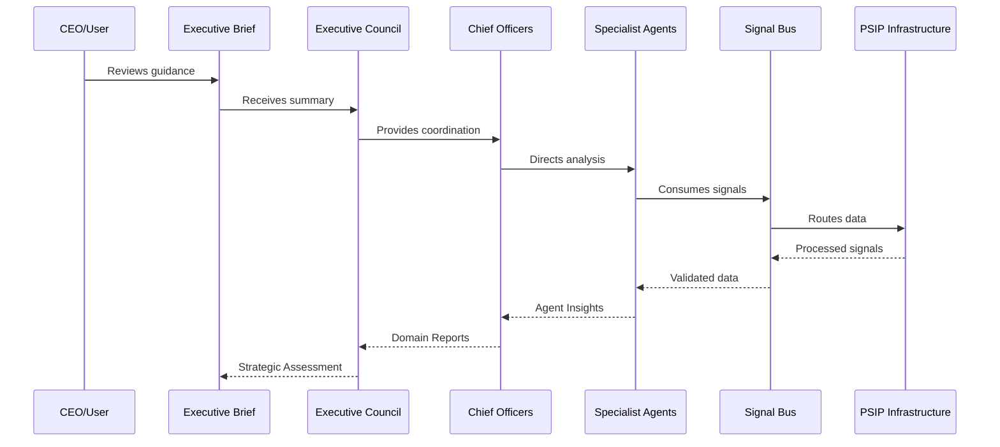

# PSIP vs Busy Bee Architecture

## Boundary Diagram

## What is PSIP?

**Personal Strategic Intelligence Platform**

The foundational intelligence infrastructure that powers Busy Bee.

| Component | Purpose |
|-----------|---------|
| Signal Architecture | Data ingestion, validation, routing |
| Strategic Intelligence Engine | Strategy brain |
| Reporting Pipeline | Intelligence flow |
| Memory Engine | Long-term learning |
| Simulation Engine | Outcome testing |

## What is Busy Bee?

**Life Operating System**

The application layer built on PSIP for personal life management.

| Component | Purpose |
|-----------|---------|
| Chief Officers | Domain leadership |
| Specialist Agents | Domain analysis |
| Executive Council | Cross-domain coordination |
| Executive Brief | User-facing output |

## Data Flow

## Boundary Rules

### Busy Bee Handles
- Domain logic
- Agent implementations
- Chief Officer synthesis
- Council coordination
- User interaction

### PSIP Handles
- Signal processing
- Validation/Normalization
- Strategy computation
- Memory storage
- Simulation

### Rule
**Agents consume signals from PSIP; reports feed into PSIP strategic engines.**

---

*Diagram: BB-DIAG-001-06*
