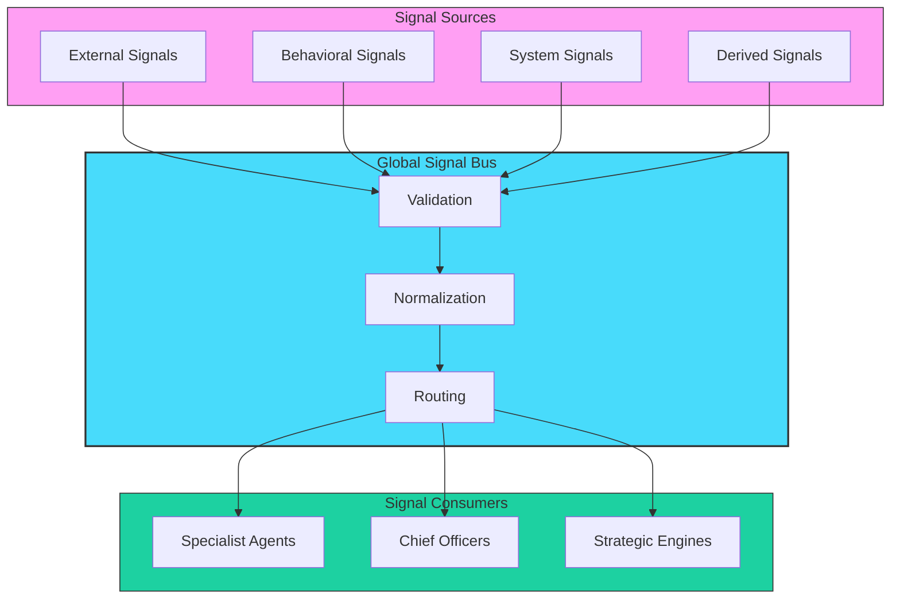
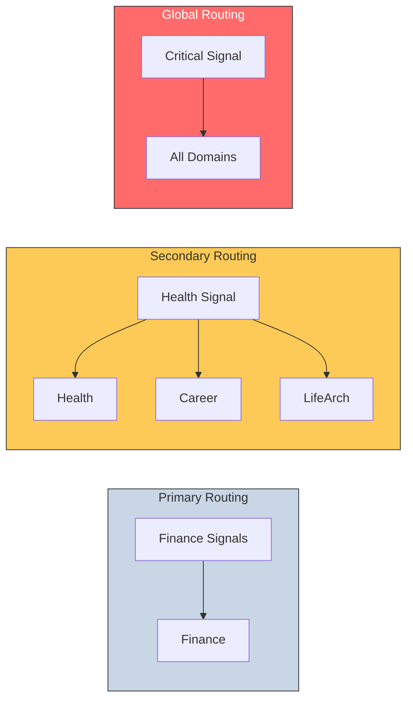

# Signal Flow Diagram

## Signal Architecture (BB-DOM-002)

## Signal Classes

| Class | Description | Examples |
|-------|-------------|----------|
| **External** | Environment data | Market prices, news, weather |
| **Behavioral** | User actions | Spending, sleep, exercise |
| **System** | Internal metrics | Portfolio, risk scores |
| **Derived** | Computed insights | Burnout probability, stress |

## Signal Flow

1. **Sources** emit raw signals
2. **Validation** checks schema and required fields
3. **Normalization** standardizes units and values
4. **Routing** sends to appropriate domains
5. **Consumers** process signals for insights

## Cross-Domain Routing

### Routing Types

- **Primary:** Signal goes to owning domain
- **Secondary:** Signal relevant to related domains (e.g., sleep affects health, career, life)
- **Global:** Critical signals route to all domains (e.g., liquidity crisis, burnout)

---

*Diagram: BB-DIAG-001-04*
